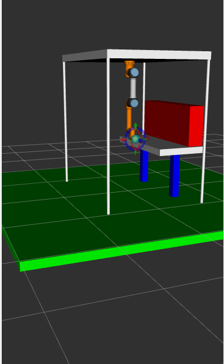
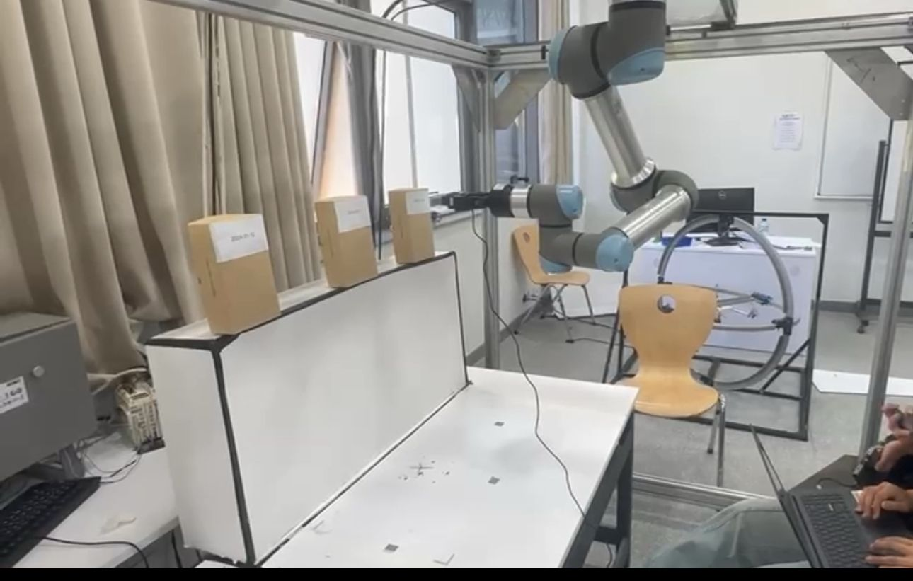

# 🤖 UR5e Warehouse Expiry Detection System

A ROS 2-based warehouse automation system where a UR5e robot uses a camera mounted on its gripper to detect expired products via OCR and push them off the shelf.

---

## 🧠 Project Overview

In warehouse environments, expired goods are a critical issue. This system leverages **robot vision**, **motion planning using MoveIt**, and **custom URDF modeling** to automate part of this inspection process:

1. A camera mounted on the robot's gripper observes product labels on a shelf.
2. OCR is used to detect printed expiry dates.
3. If the date is expired, a Python node sends movement commands to the UR5e.
4. The robot arm plans and executes a trajectory to push the expired box off the shelf.
5. The system is visualized and debugged using **RViz**, and motion planning is powered by **MoveIt**.

---

## 🖼️ Visual Demonstration

### 🧪 Simulation View (RViz)

This is the simulated warehouse environment showing the UR5e robot, a shelf, and visualized workspace.



---

### 🏭 Real-World Lab Setup

This is the actual physical setup used in the robotics lab. The UR5e is mounted on a frame and observes cardboard boxes labeled with expiry dates.



---

## ⚙️ System Workflow

1. **OCR Node**:
   - Captures image from camera.
   - Uses Tesseract OCR (or OpenCV) to extract expiry text.
   - Publishes detection results.

2. **Decision Node**:
   - Parses the detected expiry date.
   - Compares it with the current date.
   - If expired, triggers a robot command node.

3. **UR5e Control Node**:
   - Receives signal and sends trajectory/movement commands.
   - Moves the UR5e to push the expired product.

---

## 🛠️ Technologies Used

- ROS 2 (Humble )
- URDF / Xacro for robot and environment modeling
- RViz for robot simulation and visualization
- Tesseract OCR or OpenCV (Python-based vision)
- Universal Robots UR5e

---

## 🚀 How to Run the Project

```bash
# Clone and build the workspace
cd ~/ros2_ws/src
git clone https://github.com/youssefalaa1711/ur5e_warehouse_manager.git
cd ..
colcon build
source install/setup.bash

# Launch RViz or your full system (adjust as needed)
ros2 launch ur5e_robot your_launch_file.launch.py
```

---

## 📜 License

This project is licensed under the **MIT License**. See the LICENSE file for usage terms.

---

**Author**: [@youssefalaa1711](https://github.com/youssefalaa1711)  
"# Ur5e_warehouse_manager" 
